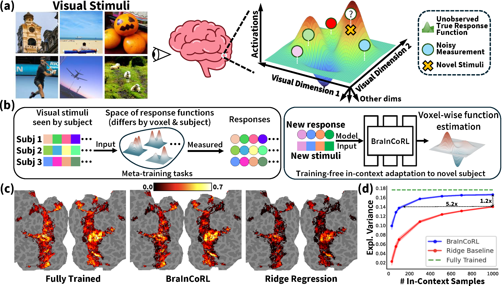

## BraInCoRL<br><sub> [NeurIPS 2025] Meta-Learning an In-Context Transformer Model of Human Higher Visual Cortex</sub>

[arXiv](https://arxiv.org/abs/2505.15813) | [PDF](https://arxiv.org/pdf/2505.15813)

<div align="center">
  
  
  **(a)** The voxelwise brain encoding problem setup.  **(b)** The meta-learning paradigm.  **(c,d)** Results (explained variance) evaluation.
</div>


## TLDR

We meta-learn a transformer based in-context learning fMRI visual cortex encoder (**BraInCoRL**) which can adapt to new human subjects without any fine-tuning.

## Introduction
Understanding functional representations within higher visual cortex is a fundamental question in computational neuroscience. While artificial neural networks pretrained on large-scale datasets exhibit striking representational alignment with human neural responses, learning image-computable models of visual cortex relies on individual-level, large-scale fMRI datasets. The necessity for expensive, time-intensive, and often impractical data acquisition limits the generalizability of encoders to new subjects and stimuli. **BraInCoRL** uses in-context learning to predict voxelwise neural responses from few-shot examples <u>*without any additional finetuning*</u> for novel subjects and stimuli. We leverage a transformer architecture that can flexibly condition on a variable number of in-context image stimuli, learning an inductive bias over multiple subjects. During training, we explicitly optimize the model for in-context learning. By jointly conditioning on image features and voxel activations, our model learns to directly generate better performing voxelwise models of higher visual cortex. We demonstrate that BraInCoRL consistently outperforms existing voxelwise encoder designs in a low-data regime when evaluated on entirely novel images, while also exhibiting strong test-time scaling behavior. The model also generalizes to an entirely new visual fMRI dataset, which uses different subjects and fMRI data acquisition parameters.
Further, BraInCoRL facilitates better interpretability of neural signals in higher visual cortex by attending to semantically relevant stimuli. Finally, we show that our framework enables interpretable mappings from natural language queries to voxel selectivity. 
<!-- <center> 

</center> -->

## Usage

### 1. Requirements

We recommend the following dependencies:

```
cuda==12.4
python==3.10
pytorch==2.5.1
```

### 2. Preparation

1. Pretrained models  
    Download model checkpoints from [here](https://mycuhk-my.sharepoint.com/:f:/g/personal/1155191596_link_cuhk_edu_hk/EkpF4pli1a1Fqaea0NTrNYoB9zTB_Yy_RnCN2HuCGUp4KA?e=7deuRO) and place them in `./checkpoints/` folder.

1. Cortex beta values and image embedding data  
    Place these data in `./data/` folder, with the below structure:

    ```
    ./data/
    ├── in_ctx_betas.npz
    ├── in_ctx_imgs.npz
    └── query_imgs.npz
    ```

### 3. Training

For training, run `train.sh` and you can set the hyperparameters in the shell script.

### 4. Inference

For inference, run `test.sh`.  
Alternatively, you can run the `inference_step_by_step.ipynb` notebook for a step by step inference guide.

## Citation
If you find this project useful for your research, please consider citing:
```
@article{yu2025meta,
  title={Meta-Learning an In-Context Transformer Model of Human Higher Visual Cortex},
  author={Yu, Muquan and Nan, Mu and Adeli, Hossein and Prince, Jacob S and Pyles, John A and Wehbe, Leila and Henderson, Margaret M and Tarr, Michael J and Luo, Andrew F},
  journal={arXiv preprint arXiv:2505.15813},
  year={2025}
}
```

## Contact
If you have any questions, please feel free to [create issues❓](https://github.com/leomqyu/BraInCoRL/issues) or [contact me 📧](mailto:leomqyu@outlook.com).
